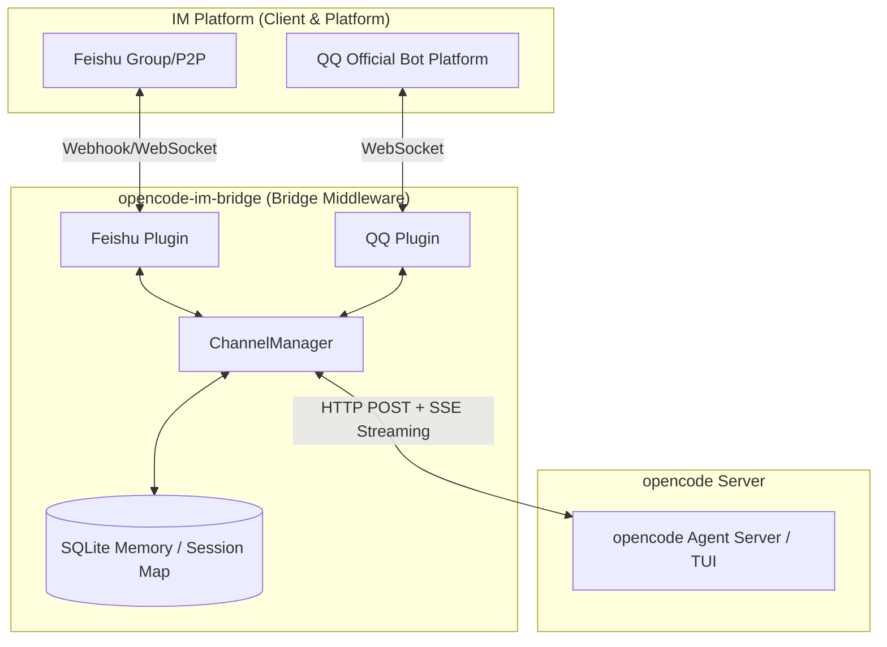

[中文版](README.zh-CN.md)

# opencode-im-bridge

> Bridge Feishu\QQ group chats to opencode TUI sessions with real-time two-way messaging.


---

## Features

- **Real-time bridging** — Messages sent in Feishu arrive in your opencode TUI instantly, and agent replies stream back as live-updating cards.
- **Multi-channel support** — Now supports bridging QQ messages via the official Node SDK (C2C/Group text interaction).
- **Interactive cards** — Agent questions and permission requests appear as clickable Feishu cards. Answer or approve directly from the chat — no need to switch to the TUI. (Currently supported primarily for Feishu)
- **WebSocket connection** — Uses Feishu's long-lived WebSocket mode. No webhook polling, no public IP required.
- **SSE streaming** — Consumes the opencode SSE event stream and debounces card updates to stay within rate limits.
- **Conversation memory** — SQLite-backed per-thread history is prepended to each message, giving the agent context across turns.
- **Session auto-discovery** — Finds and binds to the latest opencode TUI session for a working directory. Survives restarts.
- **Graceful recovery** — Reconnects to the opencode server with exponential backoff (up to 10 attempts) on startup.
- **Extensible channel layer** — `ChannelPlugin` interface lets you add Slack, Discord, or any other platform without touching core logic.
- **File and image support** — Handles image and file messages from Feishu (not just text). Downloads attachments to `${OPENCODE_CWD}/.opencode-lark/attachments/` and forwards the local path to opencode for analysis. 50 MB size limit, streaming download, filename sanitization included.

---

## Architecture



> `opencode serve` runs the HTTP server. Use `opencode attach` in a separate terminal to view the session in TUI.

**Inbound (Feishu → TUI):** Feishu sends a message over WebSocket. opencode-im-bridge normalizes it, resolves the bound session, prepends conversation history, then POSTs to the opencode API. The TUI sees the message immediately.

**Outbound (TUI → Feishu):** opencode-im-bridge subscribes to the opencode SSE stream. As the agent produces text, `TextDelta` events accumulate and a debounced card update fires. Once `SessionIdle` arrives, the final card is flushed to Feishu.

### Supported Message Types

| Message Type | Supported | Notes |
|---|---|---|
| `text` | ✅ | Plain text messages |
| `post` | ✅ | Rich text / multi-paragraph messages |
| `image` | ✅ | Photos and screenshots — downloaded and saved locally |
| `file` | ✅ | Documents, code files, etc. — downloaded and saved locally |
| `audio` / `video` / `sticker` | ❌ | Logged and skipped |

Downloaded files are saved to `${OPENCODE_CWD}/.opencode-lark/attachments/` (falls back to the system temp directory if that path isn't writable).

---

## Install

> **Note**: [Bun](https://bun.sh) is the required runtime — this project uses `bun:sqlite` which is Bun-only.

```bash
# Global install
npm install -g opencode-im-bridge
# or
bun add -g opencode-im-bridge
```

Or clone and run from source:

```bash
git clone https://github.com/ET06731/opencode-im-bridge.git
cd opencode-im-bridge
bun install
```

---

## Quick Start

Get up and running in 5 minutes. You'll need a Feishu Open Platform app with bot capability — see [Feishu App Setup](#feishu-app-setup) below for the detailed walkthrough if you haven't created one yet.

### Prerequisites

- **[Bun](https://bun.sh)** (required runtime — this project uses `bun:sqlite` which is Bun-only)
- **[opencode](https://opencode.ai)** installed locally
- A **Feishu Open Platform app** or **QQ Official Bot** with credentials (see setup guides below)

### Steps

**1. Install**

```bash
bun add -g opencode-im-bridge
# or: npm install -g opencode-im-bridge
```

**2. Start opencode server**

```bash
OPENCODE_SERVER_PORT=4096 opencode serve
```

**3. Start opencode-im-bridge**

In a second terminal:

```bash
opencode-im-bridge
```

On first run with no configuration, an interactive setup wizard guides you through:
- Selecting channels (Feishu, QQ, or both)
- Entering your Feishu/QQ App ID and App Secret/Token (masked input)
- Validating the opencode server connection
- Saving credentials to corresponding `.env.{appId}` files

The service starts automatically after setup completes.

> **Tip**: To re-run the wizard later, use `opencode-im-bridge init`.
>
> To configure manually instead, create a `.env` file with relevant credentials before starting:
> - Feishu: `FEISHU_APP_ID`, `FEISHU_APP_SECRET`
> - QQ: `QQ_APP_ID`, `QQ_SECRET`

**4. Send a test message**

Send any message to your Feishu bot. On first contact it auto-discovers the latest TUI session and replies:

> Connected to session: ses_xxxxx

After that, Feishu and the TUI share a live two-way channel. To attach the TUI:
```bash
opencode attach http://127.0.0.1:4096 --session {session_id}
```
The `session_id` is shown in opencode-im-bridge's startup logs (e.g. `Bound to TUI session: ... → ses_xxxxx`).

---

## Feishu App Setup

### 1. Create an Internal App

1. Open [Feishu Open Platform](https://open.feishu.cn/app)
2. Click **Create App** → **Create Internal App**
3. Fill in app name and description, then confirm

### 2. Enable Bot Capability

Navigate to **App Features → Bot** and enable the bot capability.

### 3. Get Credentials

Navigate to **Credentials & Basic Info** to find:

- **App ID** → set as `FEISHU_APP_ID`
- **App Secret** → set as `FEISHU_APP_SECRET`

You'll need these in Step 6 to configure opencode-im-bridge.

### 4. Configure Permissions

Navigate to **Development Config → Permissions & Scopes** and add the following:

| Permission | Scope Identifier | Purpose | Required |
|---|---|---|---|
| 获取与发送单聊、群组消息 | `im:message` | Send messages & update cards | ✅ |
| 获取用户发给机器人的单聊消息 | `im:message.p2p_msg:readonly` | Receive direct messages | ✅ |
| 获取群组中所有消息 | `im:message.group_msg` | Receive all group messages | ✅ |
| 获取群组中 @机器人的消息 | `im:message.group_at_msg:readonly` | Receive group messages that @mention the bot | ✅ |
| 获取与上传图片或文件资源 | `im:resource` | Handle message attachments | ✅ |
| 创建并发布卡片 | `cardkit:card:write` | Render interactive cards (questions, permissions) | ✅ |

### 5. Publish the App

Navigate to **App Release → Version Management & Release**, create a version and submit for review. After approval, add the bot to your workspace.

> **Note**: Internal apps in trial status can be used by app administrators immediately without review for testing.

### 6. Configure & Start opencode-im-bridge

Before configuring event subscriptions, start opencode-im-bridge so Feishu can detect the WebSocket connection.

1. Install and configure:
   ```bash
   # Install globally
   bun add -g opencode-im-bridge
   # or: npm install -g opencode-im-bridge

   # Or run from source
   # git clone https://github.com/ET06731/opencode-im-bridge.git
   # cd opencode-im-bridge && bun install
   ```

2. Start opencode server in one terminal:
   ```bash
   OPENCODE_SERVER_PORT=4096 opencode serve
   ```

3. Start opencode-im-bridge in another terminal:
   ```bash
   opencode-im-bridge
   ```
   The interactive setup wizard will guide you through entering credentials and validating the server connection. If running from source: `bun run dev`

   Keep this running while you configure event subscriptions in the next step.

> **Tip**: To see messages in real-time in the TUI, open a third terminal and attach to the session:
> ```bash
> opencode attach http://127.0.0.1:4096 --session {session_id}
> ```
> The `session_id` is shown in opencode-im-bridge's startup logs (e.g. `Bound to TUI session: ... → ses_xxxxx`).

### 7. Subscribe to Events

Navigate to **Development Config → Event Subscriptions** and:

1. Select **Long Connection** (WebSocket) mode — no public IP required
2. Add the following event:

| Event Name | Event Identifier | Purpose | Required |
|---|---|---|---|
| 接收消息 | `im.message.receive_v1` | Receive all user messages | ✅ |

> ⚠️ **Important**: opencode-im-bridge must be running (Step 6) before you can save Long Connection mode. If you see "应用未建立长连接", go back to Step 6 and ensure the app is running.

### 8. Subscribe to Callbacks (Interactive Cards)

Navigate to **Development Config → Event Subscriptions → Callback Subscription** (回调订阅) — this is a **separate section** from Event Subscription above.

1. Select **Long Connection** (WebSocket) mode
2. Add the following callback:

| Callback Name | Callback Identifier | Purpose | Required |
|---|---|---|---|
| 卡片回传交互 | `card.action.trigger` | Receive card button clicks (question answers, permission replies) | ✅ |

> ⚠️ **Important**: This is required for interactive cards (questions & permissions). Without it, clicking card buttons shows error `200340`.
>
> Event Subscription and Callback Subscription are **two separate settings**. You must configure both.

### Troubleshooting

| Symptom | Likely Cause | Fix |
|---|---|---|
| Bot doesn't receive messages | WebSocket not enabled or wrong subscription | Check event subscription, ensure Long Connection mode is selected |
| "Invalid App ID or Secret" | Wrong credentials in .env | Double-check App ID and App Secret from Step 3 |
| Messages received but no reply | opencode server not running | Ensure opencode server is running: `OPENCODE_SERVER_PORT=4096 opencode serve` |
| Card not updating in real-time | Rate limit or debounce delay | Normal behavior — updates are debounced to stay within Feishu rate limits |
| Error `200340` when clicking card buttons | Callback subscription not configured | Go to **Callback Subscription** (回调订阅) → select Long Connection → add `card.action.trigger` |
| "应用未建立长连接" when saving Long Connection mode | App not running — Feishu requires an active WebSocket connection before saving | Start opencode-im-bridge first (Step 6), then save the setting in Feishu console |

---

## QQ Bot Setup

This section covers how to create and connect a QQ Official Bot.

### 1. Create a Bot
1. Visit [QQ Open Platform](https://q.qq.com/bot/#/home).
2. Create a "QQ Bot".
3. In **Development Settings**, obtain:
   - **App ID** (mapped to `QQ_APP_ID`)
   - **App Secret** (mapped to `QQ_SECRET`)

### 2. Configure Permissions
In the dashboard, ensure you've enabled:
- Public/Private message callbacks.
- Text/Image message receiving mechanisms.

### 3. Configure opencode-im-bridge
Run `opencode-im-bridge init` and select the `qq` channel, or fill in `QQ_APP_ID` and `QQ_SECRET` in your `.env`.

---

## Configuration

### Environment Variables

| Variable | Required | Default | Description |
|----------|----------|---------|-------------|
| `FEISHU_APP_ID` | yes | | Feishu App ID |
| `FEISHU_APP_SECRET` | yes | | Feishu App Secret |
| `OPENCODE_SERVER_URL` | no | `http://localhost:4096` | opencode server URL |
| `FEISHU_WEBHOOK_PORT` | no | `3001` | HTTP webhook fallback port (only needed if not using WebSocket for card callbacks) |
| `OPENCODE_CWD` | no | `process.cwd()` | Override session discovery directory |
| `FEISHU_VERIFICATION_TOKEN` | no | | Event subscription verification token |
| `FEISHU_ENCRYPT_KEY` | no | | Event encryption key |

### JSONC Config

`opencode-im-bridge.jsonc` (gitignored; copy from `opencode-im-bridge.example.jsonc`):
(also supports `opencode-lark.jsonc` and `opencode-feishu.jsonc` for backward compatibility)

```jsonc
// opencode-im-bridge.jsonc
{
  "feishu": {
    "appId": "${FEISHU_APP_ID}",
    "appSecret": "${FEISHU_APP_SECRET}",
    "verificationToken": "${FEISHU_VERIFICATION_TOKEN}",
    "webhookPort": 3001,
    "encryptKey": "${FEISHU_ENCRYPT_KEY}"
  },
  // Default opencode agent name. This should match an agent configured in your opencode setup.
  // Common values: "build", "claude", "code" — check your opencode config for available agents.
  "defaultAgent": "build",
  "dataDir": "./data",
  "progress": {
    "debounceMs": 500,
    "maxDebounceMs": 3000
  },
  "messageDebounceMs": 10000,  // Debounce timer for batching rapid multi-message inputs (text=immediate, media=buffer)
  // Optional: Enable QQ
  "qq": {
    "appId": "${QQ_APP_ID}",
    "secret": "${QQ_SECRET}",
    "sandbox": false
  }
}
```

Supports `${ENV_VAR}` interpolation and JSONC comments. If no config file is found, the app builds a default config from `.env` values directly.

---

## Lark MCP Tools

opencode-im-bridge pairs with [lark-openapi-mcp](https://github.com/larksuite/lark-openapi-mcp) to give the opencode agent direct access to Feishu's cloud document ecosystem — read/write docs, upload files, query Bitable tables, and search the wiki, all from within a single conversation.

### Supported Capabilities

| Category | Capabilities |
|----------|-------------|
| **Docs** (docx) | Create doc, write Markdown, read Markdown, get raw text content, search docs, import file as doc |
| **Drive** | Upload local file to cloud drive, download file from cloud drive |
| **Bitable** | Create Bitable app, manage tables, list fields, record CRUD |
| **Messaging** (im) | List chats the bot belongs to, get chat members |
| **Wiki** | Search wiki nodes, get node details |

### Required User Scopes

When calling tools with `user_access_token` (i.e. `useUAT: true`), enable the following scopes in **Permissions & Scopes** in the Feishu Open Platform console:

| Scope | Purpose |
|-------|---------|
| `drive:drive` | Cloud drive read/write |
| `docx:document` | Document read/write |
| `bitable:app` | Bitable CRUD |
| `im:chat:readonly` | Query chat/group info |
| `wiki:wiki:readonly` | Wiki search and read |

### Configuration

Add a `lark-mcp` entry to the `mcp` section of your opencode config (`~/.config/opencode/config.json`):

```jsonc
{
  "mcp": {
    "lark-mcp": {
      "type": "local",
      "command": ["node", "/path/to/lark-openapi-mcp/dist/cli.js", "mcp", "-a", "${FEISHU_APP_ID}", "-s", "${FEISHU_APP_SECRET}", "--oauth", "--token-mode", "user_access_token", "-l", "zh"],
      "enabled": true
    }
  }
}
```

> **Note**: Pass `--token-mode user_access_token` to call tools on behalf of a user (required for drive uploads, wiki operations, etc.). Replace `/path/to/lark-openapi-mcp` with the actual install path after cloning/installing the package.

---

## Project Structure

```
src/
├── index.ts         # Entry point, 9-phase startup + graceful shutdown
├── types.ts         # Shared type definitions
├── channel/         # ChannelPlugin interface, ChannelManager, FeishuPlugin
├── feishu/          # Feishu REST client, CardKit, WebSocket, message dedup
├── handler/         # MessageHandler (inbound pipeline) + StreamingBridge (SSE → cards)
├── session/         # TUI session discovery, thread→session mapping, progress cards
├── streaming/       # EventProcessor (SSE parsing), SessionObserver, SubAgentTracker
├── cron/            # CronService (scheduled jobs) + HeartbeatService
├── utils/           # Config loader, logger, SQLite init, EventListenerMap
```

---

## Development

```bash
bun run dev          # Watch mode, auto-restart on changes
bun run start        # Production mode
bun run test:run     # Run all tests (vitest)
bun run build        # Compile TypeScript to dist/
```

> **Note:** Use `bun run test:run` rather than `bun test`. The latter picks up both `src/` and `dist/` test files; `vitest` is configured to scope to `src/` only.

---

## Contributing

See [CONTRIBUTING.md](CONTRIBUTING.md) for guidelines on issues, pull requests, and code style.

---

## License

[MIT](LICENSE) © 2026 opencode-im-bridge contributors
