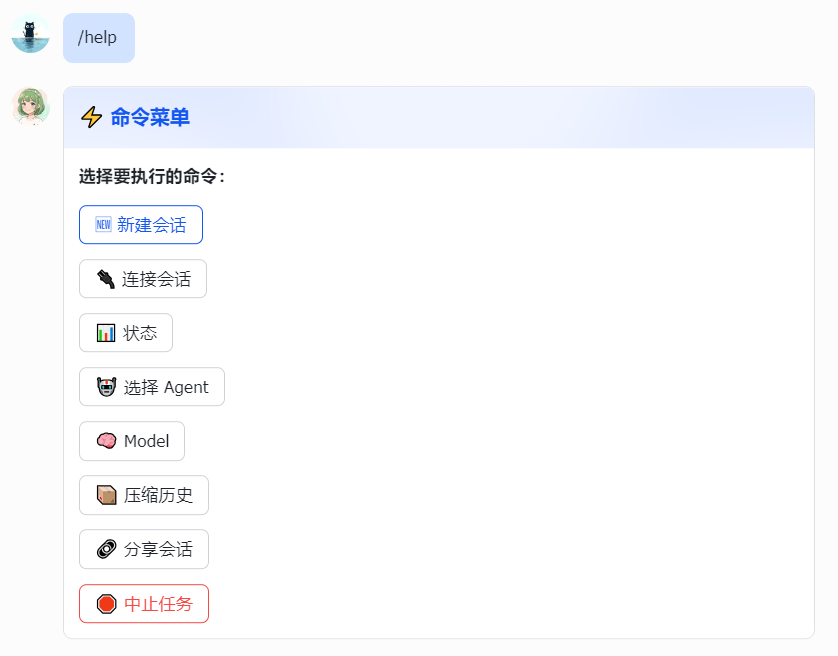

[English](README-en.md)

# opencode-im-bridge

> 将飞书\QQ\Telegram\Discord\微信机器人与 opencode TUI session 打通，实现双向实时消息转发。


---

## 功能特性

- **实时桥接** — 飞书消息即时出现在 opencode TUI，agent 回复以动态卡片形式推送回飞书。支持 **Markdown 格式渲染**（标题、列表、代码块等）。
- **多渠道支持** — 现在支持通过官方 Node SDK 桥接 QQ、Telegram、Discord 和微信消息。微信使用腾讯官方 iLink Bot API，支持扫码登录。
- **交互式卡片** — agent 的提问和权限请求以可点击的飞书卡片呈现，直接在聊天中回答或审批，无需切换到 TUI。(目前主要在飞书端支持)
- **WebSocket 长连接** — 采用飞书 / QQ 的 WebSocket 长连接模式，无需公网 IP，无需轮询。
- **SSE 流式输出** — 订阅 opencode SSE 事件流，防抖处理卡片更新，避免触发频率限制。
- **对话记忆** — SQLite 存储每个会话的对话历史，每次消息自动携带上下文。
- **Session 自动发现** — 自动发现并绑定当前目录的最新 TUI session，重启后映射关系持久保存。
- **优雅重连** — 启动时指数退避重连 opencode server，最多重试 10 次，无需手动等待 server 就绪。
- **可扩展渠道层** — `ChannelPlugin` 接口设计，可扩展接入 Slack、Discord、QQ 等其他平台，无需修改核心逻辑。
- **文件与图片支持** — 支持飞书图片和文件消息（不限于文字）。附件下载保存至 `${OPENCODE_CWD}/.opencode-im-bridge/attachments/`，并将本地路径传给 opencode 供其读取分析。支持流式下载，50 MB 大小限制，文件名安全处理。
- **文件自动发送** — Agent 将文件/图片保存到 attachments 目录后，系统通过 snapshot 机制自动检测并发送给用户。支持图片、音频、视频、文档（PDF/Word/Excel/PPT/压缩包等）。

---

### 支持的消息类型

| 消息类型 | 飞书 | QQ | Telegram | Discord | 微信 | 说明 |
|---|---|---|---|---|---|---|
| `text` | ✅ | ✅ | ✅ | ✅ | ✅ | 普通文字消息 |
| `post` | ✅ | ✅ | ❌ | ❌ | ❌ | 富文本 / 多段落消息 |
| `image` | ✅ | ✅ | ✅ | ✅ | ✅ | 图片和截图 |
| `file` | ✅ | ✅ | ✅ | ✅ | ⏳ | 文档、代码文件等 |
| `audio` | ✅ | ✅ | ✅ | ✅ | ⏳ | 语音消息（带文字识别） |
| `video` | ✅ | ✅ | ✅ | ✅ | ⏳ | 视频消息 |
| `sticker` | ❌ | ❌ | ❌ | ❌ | ❌ | 不支持 |

> **注意**：QQ C2C 文件发送因 QQ 平台限制，文件名会被修改，发送后会自动提示原始文件名。

> ⏳ = 功能开发中

下载的文件保存在 `${OPENCODE_CWD}/.opencode-im-bridge/attachments/`（若该路径不可写则回退至系统临时目录）。

### 平台对比

| 平台 | 通信协议 | 认证方式 | Markdown | 富媒体 | 流式输出 |
|------|----------|----------|----------|--------|----------|
| 飞书 | WebSocket | App ID + Secret | ✅ | ✅ 卡片 | ✅ 卡片 |
| QQ | WebSocket | App ID + Secret | ✅ | ✅ | ❌ |
| Telegram | HTTP Bot API | Bot Token | ✅ | ✅ | ❌ |
| Discord | HTTP Bot API | Bot Token | ✅ | ✅ | ❌ |
| 微信 | HTTP 长轮询 | 扫码登录 | ✅ | ⏳ | ⏳ |

### 斜杠命令 (Slash Commands)

在聊天窗口中输入斜杠命令可直接进行会话管理：
- `/new`：新建会话（并自动绑定到当前聊天）
- `/sessions`：获取最近会话列表及当前绑定状态（飞书返回交互式卡片，QQ 返回文本列表）
- `/connect {session_id}`：将当前聊天连接/绑定到指定的历史会话
- `/compact`：执行上下文历史压缩（对应 `session.compact`）
- `/share`：分享当前会话（对应 `session.share`）
- `/abort`：中止当前正在执行的任务
- `/model` 或 `/models`：切换模型（飞书返回交互式卡片，支持下拉菜单翻页）
- `/agent`：切换 Agent（飞书返回交互式卡片）
- `/status`：查看当前状态（服务器、模型、会话、Context 用量等）
- `/help` 或 `/`：查看命令帮助菜单



---

## 快速开始

5 分钟即可上手。

### 前置要求

- **[Bun](https://bun.sh)**（必需运行时，本项目使用 `bun:sqlite`，仅 Bun 支持）
- **[opencode](https://opencode.ai)** 已安装在本地
- 已配置凭证的飞书开放平台应用、QQ、Telegram、Discord 等平台机器人，或微信 ClawBot 插件（👉参见[《机器人配置指南》](docs/CONFIGURATION.zh-CN.md)）

### 步骤

**1. 安装**

```bash
# 全局安装
npm install -g opencode-im-bridge
# 或
bun add -g opencode-im-bridge
```

或从源码运行：

```bash
git clone https://github.com/ET06731/opencode-im-bridge.git
cd opencode-im-bridge
bun install
```

**2. 启动 opencode server**

```bash
# macOS / Linux
OPENCODE_SERVER_PORT=4096 opencode serve

# Windows (PowerShell)
$env:OPENCODE_SERVER_PORT=4096; opencode serve
```

**3. 启动 opencode-im-bridge**

在第二个终端：

```bash
opencode-im-bridge
```

首次运行无配置时，交互式向导将引导你完成：
- 选择渠道（飞书、QQ、Telegram、Discord、微信 或 全部）
- 输入各渠道的 App ID、App Secret/Token（密码遮蔽输入）
- 验证 opencode server 连通性

配置完成后服务自动启动。

> **提示**：如需重新配置，运行 `opencode-im-bridge init`。

> 如需手动配置，可在启动前创建 `.env` 文件并填写相关凭据：
> - 飞书：`FEISHU_APP_ID`, `FEISHU_APP_SECRET`
> - QQ：`QQ_APP_ID`, `QQ_SECRET`

**4. 发送测试消息**

向机器人发送任意消息。首次联系时自动发现最新 TUI session 并回复：

> Connected to session: ses_xxxxx

首次消息后机器人收到 session 绑定通知，之后双向消息互通。要在 TUI 中查看该会话：
```bash
opencode attach http://127.0.0.1:4096 --session {session_id}
```
`session_id` 会在 opencode-im-bridge 启动日志中显示（如 `Bound to TUI session: ... → ses_xxxxx`）。

---

## 手动配置说明（面向开发者）

### 环境变量

| 变量 | 必需 | 默认值 | 说明 |
|----------|----------|---------|-------------|
| `FEISHU_APP_ID` | 否 | | 飞书应用 App ID |
| `FEISHU_APP_SECRET` | 否 | | 飞书应用 App Secret |
| `QQ_APP_ID` | 否 | | QQ 应用 App ID |
| `QQ_SECRET` | 否 | | QQ 应用 App Secret |
| `TELEGRAM_BOT_TOKEN` | 否 | | Telegram Bot Token |
| `DISCORD_BOT_TOKEN` | 否 | | Discord Bot Token |
| `WECHAT_ENABLED` | 否 | | 设为 `true` 启用微信 |
| `WECHAT_SESSION_FILE` | 否 | `.opencode-lark/wechat-session.json` | 微信登录态保存路径 |
| `OPENCODE_SERVER_URL` | 否 | `http://localhost:4096` | opencode server 地址 |
| `FEISHU_WEBHOOK_PORT` | 否 | `3001` | HTTP webhook 回退端口（仅在不使用 WebSocket 接收卡片回调时需要） |
| `OPENCODE_CWD` | 否 | `process.cwd()` | 覆盖 session 发现目录 |
| `FEISHU_VERIFICATION_TOKEN` | 否 | | 事件订阅验证 token |
| `FEISHU_ENCRYPT_KEY` | 否 | | 事件加密密钥 |

### JSONC 配置文件

`opencode-im-bridge.jsonc`（从 `opencode-im-bridge.example.jsonc` 复制）：

```jsonc
// opencode-im-bridge.jsonc
{
  // 可选：启用飞书
  "feishu": {
    "appId": "${FEISHU_APP_ID}",
    "appSecret": "${FEISHU_APP_SECRET}",
    "verificationToken": "${FEISHU_VERIFICATION_TOKEN}",
    "webhookPort": 3001,
    "encryptKey": "${FEISHU_ENCRYPT_KEY}"
  },
  // 可选：启用 QQ
  "qq": {
    "appId": "${QQ_APP_ID}",
    "secret": "${QQ_SECRET}",
    "sandbox": false
  },
  // 可选：启用微信（扫码登录，无需 App ID）
  "wechat": {
    "enabled": true,
    "sessionFile": "./data/wechat-session.json"
  },
  // 默认 opencode agent 名称，需与 opencode 配置中的 agent 匹配。
  // 常见值："build"、"claude"、"code" — 请查看你的 opencode 配置。
  "defaultAgent": "build",
  "dataDir": "./data",
  "progress": {
    "debounceMs": 500,
    "maxDebounceMs": 3000
  }
}
```

支持 `${ENV_VAR}` 环境变量插值和 JSONC 注释。无配置文件时自动从 `.env` 构建默认配置。

---

## 项目结构

```
src/
├── index.ts         # 入口，9 阶段启动 + 优雅关闭
├── types.ts         # 共享类型定义
├── channel/         # ChannelPlugin 接口、ChannelManager、FeishuPlugin
├── feishu/          # 飞书 REST 客户端、CardKit、WebSocket、消息去重
├── handler/         # MessageHandler（入站管道）+ StreamingBridge（SSE → 卡片）
├── session/         # TUI session 发现、thread→session 映射、进度卡片
├── streaming/       # EventProcessor（SSE 解析）、SessionObserver、SubAgentTracker
├── memory/          # SQLite 驱动的会话级对话记忆
├── cron/            # CronService（定时任务）+ HeartbeatService
└── utils/           # 配置加载、日志、SQLite 初始化、EventListenerMap
```

---

## 开发

```bash
bun run dev          # 开发模式，代码变更自动重启
bun run start        # 生产模式
bun run test:run     # 运行全部测试
bun run build        # 编译到 dist/
```

> 使用 `bun run test:run` 而非 `bun test`，后者会同时扫描 `src/` 和 `dist/` 下的测试文件。

---

## 参与贡献

请参阅 [CONTRIBUTING.md](docs/CONTRIBUTING.md) 了解提 issue、提 PR 和代码风格的规范。

---

## 致谢

感谢以下开源项目的贡献：

- [guazi04/opencode-lark](https://github.com/guazi04/opencode-lark)
- [op7418/Claude-to-IM-skill](https://github.com/op7418/Claude-to-IM-skill)

---

## License

[MIT](LICENSE) © 2026 opencode-im-bridge contributors
