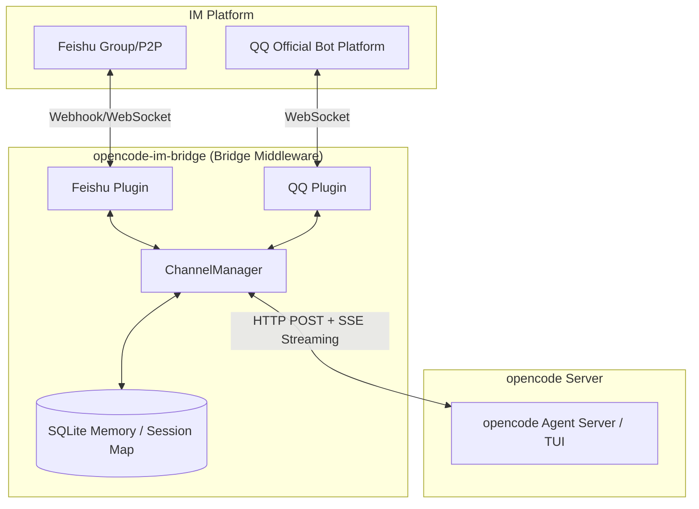

[中文版](README.zh-CN.md)

# opencode-im-bridge

> Bridge Feishu\QQ group chats to opencode TUI sessions with real-time two-way messaging.


---

## Features

- **Real-time bridging** — Messages sent in Feishu arrive in your opencode TUI instantly. Agent replies stream back as live-updating cards with **Markdown rendering support** (headings, lists, code blocks, etc.).
- **Multi-channel support** — Now supports bridging QQ, Telegram, and Discord messages via their official platform APIs. QQ channel also supports Markdown rendering.
- **Interactive cards** — Agent questions and permission requests appear as clickable Feishu cards. Answer or approve directly from the chat — no need to switch to the TUI. (Currently supported primarily for Feishu)
- **WebSocket connection** — Uses Feishu's long-lived WebSocket mode. No webhook polling, no public IP required.
- **SSE streaming** — Consumes the opencode SSE event stream and debounces card updates to stay within rate limits.
- **Conversation memory** — SQLite-backed per-thread history is prepended to each message, giving the agent context across turns.
- **Session auto-discovery** — Finds and binds to the latest opencode TUI session for a working directory. Survives restarts.
- **Graceful recovery** — Reconnects to the opencode server with exponential backoff (up to 10 attempts) on startup.
- **Extensible channel layer** — `ChannelPlugin` interface lets you add Slack, Discord, or any other platform without touching core logic.
- **File and image support** — Handles image and file messages from Feishu (not just text). Downloads attachments to `${OPENCODE_CWD}/.opencode-im-bridge/attachments/` and forwards the local path to opencode for analysis. 50 MB size limit, streaming download, filename sanitization included.

---

## Architecture



> `opencode serve` runs the HTTP server. Use `opencode attach` in a separate terminal to view the session in TUI.

**Inbound (Feishu → TUI):** Feishu sends a message over WebSocket. opencode-im-bridge normalizes it, resolves the bound session, prepends conversation history, then POSTs to the opencode API. The TUI sees the message immediately.

**Outbound (TUI → Feishu):** opencode-im-bridge subscribes to the opencode SSE stream. As the agent produces text, `TextDelta` events accumulate and a debounced card update fires. Once `SessionIdle` arrives, the final card is flushed to Feishu.

### Supported Message Types

| Message Type | Supported | Notes |
|---|---|---|
| `text` | ✅ | Plain text messages, supports Markdown rendering |
| `post` | ✅ | Rich text / multi-paragraph messages |
| `image` | ✅ | Photos and screenshots — downloaded and saved locally |
| `file` | ✅ | Documents, code files, etc. — downloaded and saved locally |
| `audio` / `video` / `sticker` | ❌ | Logged and skipped |

Downloaded files are saved to `${OPENCODE_CWD}/.opencode-lark/attachments/` (falls back to the system temp directory if that path isn't writable).

#### Slash Commands

Type slash commands directly in the chat to manage opencode sessions:
- `/new`: Create a new session (and bind it to the current chat)
- `/sessions`: List recent sessions and current bound status (Interactive card in Feishu, text list in QQ)
- `/connect {session_id}`: Connect/bind the current chat to a specific historical session
- `/compact`: Compact context history (equivalent to `session.compact`)
- `/share`: Share the current session (equivalent to `session.share`)
- `/abort`: Abort the currently executing task
- `/help` or `/`: Show the command help menu

---

## Install

> **Note**: [Bun](https://bun.sh) is the required runtime — this project uses `bun:sqlite` which is Bun-only.

```bash
# Global install
npm install -g opencode-im-bridge
# or
bun add -g opencode-im-bridge
```

Or clone and run from source:

```bash
git clone https://github.com/ET06731/opencode-im-bridge.git
cd opencode-im-bridge
bun install
```

---

## Quick Start

Get up and running in 5 minutes. You'll need a Feishu Open Platform app with bot capability — see [Feishu App Setup](#feishu-app-setup) below for the detailed walkthrough if you haven't created one yet.

### Prerequisites

- **[Bun](https://bun.sh)** (required runtime — this project uses `bun:sqlite` which is Bun-only)
- **[opencode](https://opencode.ai)** installed locally
- A **Feishu Open Platform app** or **QQ Official Bot** with credentials (see setup guides below)

### Steps

**1. Install**

```bash
bun add -g opencode-im-bridge
# or: npm install -g opencode-im-bridge
```

**2. Start opencode server**

```bash
# macOS / Linux
OPENCODE_SERVER_PORT=4096 opencode serve

# Windows (PowerShell)
$env:OPENCODE_SERVER_PORT=4096; opencode serve
```

**3. Start opencode-im-bridge**

In a second terminal:

```bash
opencode-im-bridge
```

On first run with no configuration, an interactive setup wizard guides you through:
- Selecting channels (Feishu, QQ, or both)
- Entering your Feishu/QQ App ID and App Secret/Token (masked input)
- Validating the opencode server connection
- Saving credentials to corresponding `.env.{appId}` files

The service starts automatically after setup completes.

> **Tip**: To re-run the wizard later, use `opencode-im-bridge init`.
>
> To configure manually instead, create a `.env` file with relevant credentials before starting:
> - Feishu: `FEISHU_APP_ID`, `FEISHU_APP_SECRET`
> - QQ: `QQ_APP_ID`, `QQ_SECRET`

**4. Send a test message**

Send any message to your Feishu bot. On first contact it auto-discovers the latest TUI session and replies:

> Connected to session: ses_xxxxx

After that, Feishu and the TUI share a live two-way channel. To attach the TUI:
```bash
opencode attach http://127.0.0.1:4096 --session {session_id}
```
The `session_id` is shown in opencode-im-bridge's startup logs (e.g. `Bound to TUI session: ... → ses_xxxxx`).

---

## Bot Configuration

We support multiple platforms including Feishu, QQ, Telegram, and Discord.

👉 **[Read the Bot Configuration Guide](CONFIGURATION.md)**

### Feishu Permission Scopes

For the Feishu bot to work correctly, enable the following permissions in the Feishu Open Platform console. You can copy the JSON below to use the **Batch Import** feature in **Development Config → Permissions & Scopes**:

| Permission | Scope Identifier | Purpose | Required |
|---|---|---|---|
| 获取与发送单聊、群组消息 | `im:message` | Send messages & update cards | ✅ |
| 获取用户发给机器人的单聊消息 | `im:message.p2p_msg:readonly` | Receive direct messages | ✅ |
| 获取群组中所有消息 | `im:message.group_msg` | Receive all group messages | ✅ |
| 获取群组中 @机器人的消息 | `im:message.group_at_msg:readonly` | Receive group messages that @mention the bot | ✅ |
| 获取与上传图片或文件资源 | `im:resource` | Handle message attachments | ✅ |
| 创建并发布卡片 | `cardkit:card:write` | Render interactive cards (questions, permissions) | ✅ |

```json
{
  "scopes": {
    "tenant": [
      "im:message",
      "im:message.p2p_msg:readonly",
      "im:message.group_msg",
      "im:message.group_at_msg:readonly",
      "im:resource",
      "cardkit:card:write"
    ]
  }
}
```


---
---

## Configuration

### Environment Variables

| Variable | Required | Default | Description |
|----------|----------|---------|-------------|
| `FEISHU_APP_ID` | yes | | Feishu App ID |
| `FEISHU_APP_SECRET` | yes | | Feishu App Secret |
| `OPENCODE_SERVER_URL` | no | `http://localhost:4096` | opencode server URL |
| `FEISHU_WEBHOOK_PORT` | no | `3001` | HTTP webhook fallback port (only needed if not using WebSocket for card callbacks) |
| `OPENCODE_CWD` | no | `process.cwd()` | Override session discovery directory |
| `FEISHU_VERIFICATION_TOKEN` | no | | Event subscription verification token |
| `FEISHU_ENCRYPT_KEY` | no | | Event encryption key |

### JSONC Config

`opencode-im-bridge.jsonc` (gitignored; copy from `opencode-im-bridge.example.jsonc`):
(also supports `opencode-lark.jsonc` and `opencode-feishu.jsonc` for backward compatibility)

```jsonc
// opencode-im-bridge.jsonc
{
  "feishu": {
    "appId": "${FEISHU_APP_ID}",
    "appSecret": "${FEISHU_APP_SECRET}",
    "verificationToken": "${FEISHU_VERIFICATION_TOKEN}",
    "webhookPort": 3001,
    "encryptKey": "${FEISHU_ENCRYPT_KEY}"
  },
  // Default opencode agent name. This should match an agent configured in your opencode setup.
  // Common values: "build", "claude", "code" — check your opencode config for available agents.
  "defaultAgent": "build",
  "dataDir": "./data",
  "progress": {
    "debounceMs": 500,
    "maxDebounceMs": 3000
  },
  "messageDebounceMs": 10000,  // Debounce timer for batching rapid multi-message inputs (text=immediate, media=buffer)
  // Optional: Enable QQ
  "qq": {
    "appId": "${QQ_APP_ID}",
    "secret": "${QQ_SECRET}",
    "sandbox": false
  }
}
```

Supports `${ENV_VAR}` interpolation and JSONC comments. If no config file is found, the app builds a default config from `.env` values directly.

---

## Lark MCP Tools

opencode-im-bridge pairs with [lark-openapi-mcp](https://github.com/larksuite/lark-openapi-mcp) to give the opencode agent direct access to Feishu's cloud document ecosystem — read/write docs, upload files, query Bitable tables, and search the wiki, all from within a single conversation.

### Supported Capabilities

| Category | Capabilities |
|----------|-------------|
| **Docs** (docx) | Create doc, write Markdown, read Markdown, get raw text content, search docs, import file as doc |
| **Drive** | Upload local file to cloud drive, download file from cloud drive |
| **Bitable** | Create Bitable app, manage tables, list fields, record CRUD |
| **Messaging** (im) | List chats the bot belongs to, get chat members |
| **Wiki** | Search wiki nodes, get node details |

### Required User Scopes

When calling tools with `user_access_token` (i.e. `useUAT: true`), enable the following scopes in **Permissions & Scopes** in the Feishu Open Platform console:

| Scope | Purpose |
|-------|---------|
| `drive:drive` | Cloud drive read/write |
| `docx:document` | Document read/write |
| `bitable:app` | Bitable CRUD |
| `im:chat:readonly` | Query chat/group info |
| `wiki:wiki:readonly` | Wiki search and read |

### Configuration

Add a `lark-mcp` entry to the `mcp` section of your opencode config (`~/.config/opencode/config.json`):

```jsonc
{
  "mcp": {
    "lark-mcp": {
      "type": "local",
      "command": ["node", "/path/to/lark-openapi-mcp/dist/cli.js", "mcp", "-a", "${FEISHU_APP_ID}", "-s", "${FEISHU_APP_SECRET}", "--oauth", "--token-mode", "user_access_token", "-l", "zh"],
      "enabled": true
    }
  }
}
```

> **Note**: Pass `--token-mode user_access_token` to call tools on behalf of a user (required for drive uploads, wiki operations, etc.). Replace `/path/to/lark-openapi-mcp` with the actual install path after cloning/installing the package.

---

## Project Structure

```
src/
├── index.ts         # Entry point, 9-phase startup + graceful shutdown
├── types.ts         # Shared type definitions
├── channel/         # ChannelPlugin interface, ChannelManager, FeishuPlugin
├── feishu/          # Feishu REST client, CardKit, WebSocket, message dedup
├── handler/         # MessageHandler (inbound pipeline) + StreamingBridge (SSE → cards)
├── session/         # TUI session discovery, thread→session mapping, progress cards
├── streaming/       # EventProcessor (SSE parsing), SessionObserver, SubAgentTracker
├── cron/            # CronService (scheduled jobs) + HeartbeatService
├── utils/           # Config loader, logger, SQLite init, EventListenerMap
```

---

## Development

```bash
bun run dev          # Watch mode, auto-restart on changes
bun run start        # Production mode
bun run test:run     # Run all tests (vitest)
bun run build        # Compile TypeScript to dist/
```

> **Note:** Use `bun run test:run` rather than `bun test`. The latter picks up both `src/` and `dist/` test files; `vitest` is configured to scope to `src/` only.

---

## Contributing

See [CONTRIBUTING.md](CONTRIBUTING.md) for guidelines on issues, pull requests, and code style.

---

## Acknowledgements

The development for this project were made reference to the following open-source projects:

- [guazi04/opencode-lark](https://github.com/guazi04/opencode-lark)
- [op7418/Claude-to-IM-skill](https://github.com/op7418/Claude-to-IM-skill)

---

## License

[MIT](LICENSE) © 2026 opencode-im-bridge contributors
